# Local openBIS Jupyter installation

Andreas Cuny | CSB | ETH  Zurich

This documentation describes how to configure a local Jupyter installation such that one can establish a connection to any existing openBIS-LIMS/ELN instance. It is assumed that one has access to an existing openBIS instance. If you are not familiar with openBIS click here to leard more about openBIS-LIMS/ELN.

## How to use Jupyter together with openBIS?

To connect Jupyter with an existing openBIS instance there exist currently two ways:

- __[pyBIS](#connection-to-openbis-using-pybis)__: purely Python based requiring the notebook to run a python kernel.

- __[openbis-jupyter-extension](#Connection to openBIS using openbis-jupyter-extension)__: language independent Jupyter extension.

  

## How to install Jupyter? 

The easiest way to install Jupyter is to install miniconda for your operating system with Python 3.x 

`https://docs.conda.io/en/latest/miniconda.html`

If you have other Python installations it is good practice to install everything new into a separate environment. Also such an environment can be later used to create a snapshot of your installation and shared with other to build exactly the identical environment.

 Start the terminal or (Anaconda Prompt under Windows) and type:

```bash
conda create -n <MYENV> python=3.5
```

Rename <MYENV> with the name you want to give to your environment.

Activate the environment you just created.

```bash
conda activate <MYENV>
```

_Note: more information about conda environments can be found [here](https://docs.conda.io/projects/conda/en/latest/user-guide/tasks/manage-environments.html)_

Install the openbis-jupyter-extension by typing:

```python
pip install openbis-jupyter-extension
```

This will install pyBIS as well. _Note: there is a bug in the current version so for the moment please try to install a previous version: pip install openbis-jupyter-extension==0.2.2_

If you are interested in pyBIS only just type:

```python
pip install pybis
```

After the successful installation navigate to the directory where you keep your projects or documents. 

_Note: This folder will be your top-level as Jupyter is started from this directory it will only see all files within this folder and in any subdirectory. If you want to be able to access the whole file system you would need to start at the root (UNIX '/' or WIN 'C:')_

For LINUX / OSX type for example:

```bash
cd /User/<USERNAME>/
```

For WINDOWS type for example:

```bash
cd C:\Users\<USERNAME>\Documents
```

where as <USERNAME> has to be replaced with your actual user name. Then type:

```bash
jupyter notebook
```

This will start Jupyter in your default browser and you well see all the fills in the current folder as tree (If not it displays an URL which you need to copy and paste it in your browser of choice). 

Now you can start a notebook of your choice. (_Note: currently you have only a Python kernel. To install more Kernels in other languages [ see section below ](#installation-of-additional-kernels)_).

## Connection to openBIS using pyBIS

This connection works only with Python. Using a Python notebook and pyBIS you can do everything you are used to to over the web interface so far. It allows you to download datasets, register new datasets, samples etc. Furthermore it allows for the automation of batch registering samples or download of datasets etc.

To learn more about all the functions of pyBIS please read the documentation here:

[pyBIS documentation](https://sissource.ethz.ch/sispub/openbis/blob/master/pybis/src/python/README.md)

Or work trough the tutorials to learn more about the different aspects and functions of pyBIS:

[pyBIS tutorial](https://sissource.ethz.ch/sispub/pybis-notebooks)

Here only a brief example is given how to use pyBIS to connect to openBIS and browse openBIS for i.e. an object (previous: sample).

Start a Python notebook and add the following code lines and hit the "run" button or "Ctrl+Enter". You will then be prompted for your password.

```python
from pybis import Openbis
import getpass
o = Openbis(url='https://openbis-csb.ethz.ch/openbis', verify_certificates=False)
password = getpass.getpass()
o.login('USERNAME', password)
```

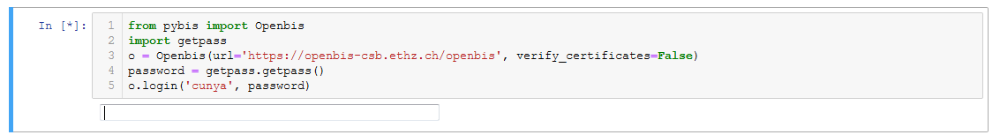

Now you can search openBIS for what ever you have entered. As example we are looking for the FASTA file of a plasmid (FRP320) and are interested in its storage location as well as for which yeast marker it contains. We create a new cell and add the following code. 

```python
plasmid = o.get_sample('/YEAST_LAB/FRP320')
plasmid.props.all()
```

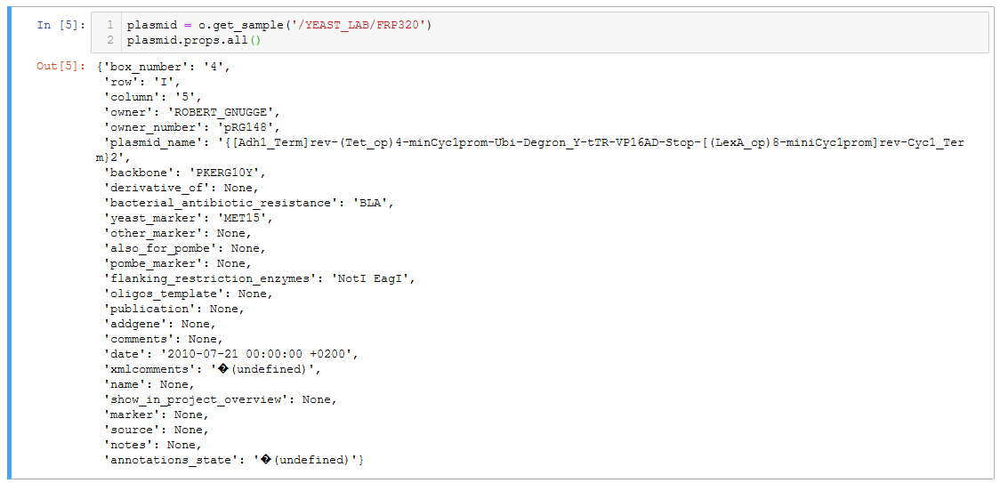

_Note: for a detailed description of how to retrieve a sample, register and upload a new sample to openBIS using pyBIS read the [pyBIS documentation](https://sissource.ethz.ch/sispub/openbis/blob/master/pybis/src/python/README.md)_.

To get to the attached file i.e the FASTA file of this plasmid we can type:

```python
plasmid.get_datasets()
```

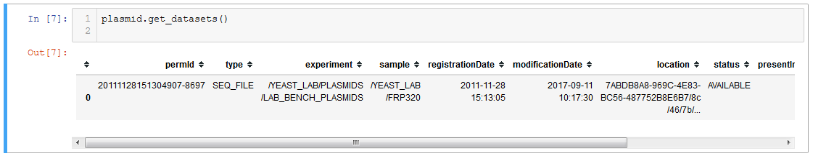

To download the FASTA file we use its permID and specify the download location:

```python
ds = o.get_dataset('20111128151304907-8697')
ds.download(destination='/local0/scratch/yeast_trafo_project', wait_until_finished=False)
```

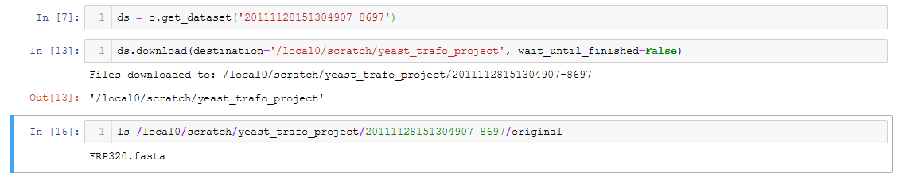

Now you could for example import the downloaded FASTA or GB file into your notebook for documentation or to display and modify it.

```python
from dna_features_viewer import BiopythonTranslator, CircularGraphicRecord
graphic_record = BiopythonTranslator().translate_record(
    "/local0/scratch/yeast_trafo_project/20111128151304907-8697/generated/FRP320.gb")
circular_rec = CircularGraphicRecord(sequence_length=graphic_record.sequence_length, features=graphic_record.features)
ax2, _ = circular_rec.plot(figure_width=10)
ax2.figure.savefig("FRP320_NEW_FIGURE.png", bbox_inches="tight")
```

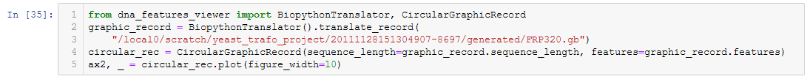

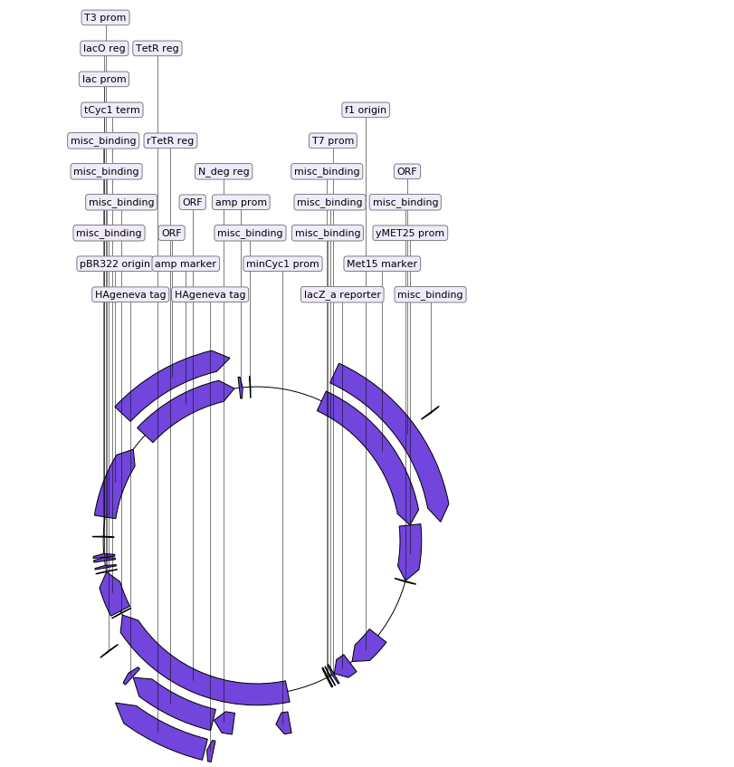

To save the figure created above we create a new dataset of type ANALYZED_DATA and save it (will upload and register it in openBIS).

```python
ds_new = o.new_dataset(type = 'ANALYZED_DATA', 
    experiment = '/CUNYA/YEAST_TRANSFORMATION_OPTIMIZATION/YEAST_TRANSFORMATION_OPTIMIZATION_EXP_3', 
    files = ['FRP320_NEW_FIGURE.png'])
ds_new.save()
```

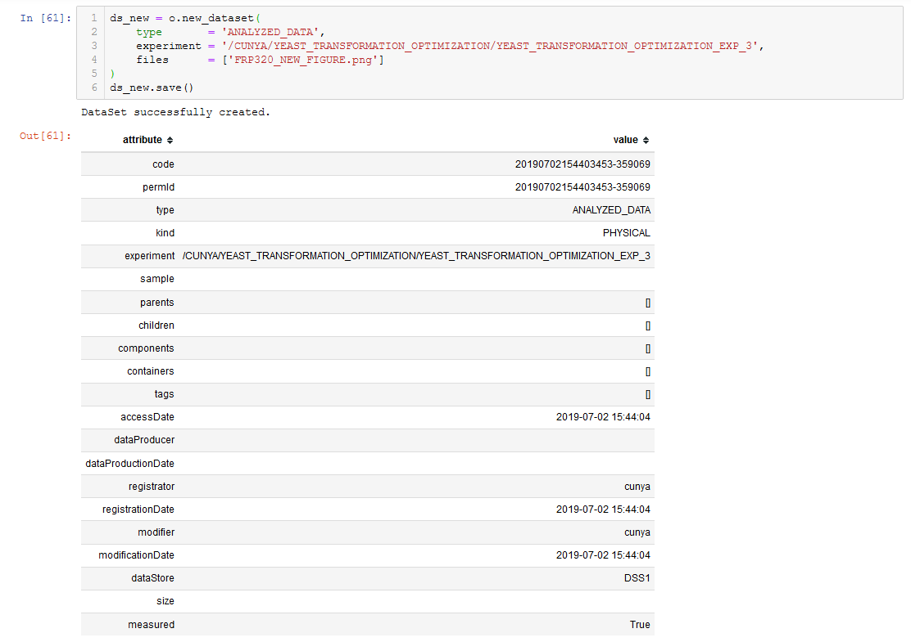

In the browser, on the right there is now our new figure attached as ANALYZED_DATA dataset as uploaded/saved before.

## 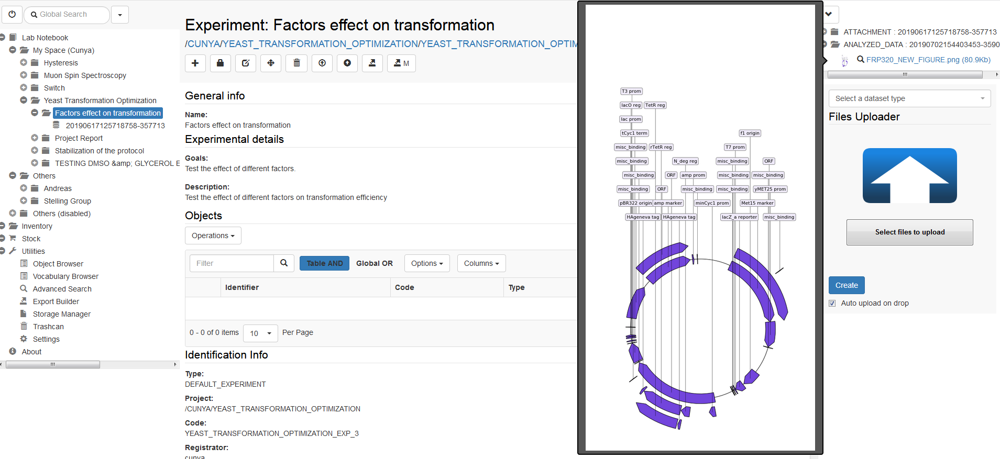

## Connection to openBIS using openbis-jupyter-extension

This extension allows you to connect to openBIS independent of the notebook language (i.e. works also with R, Julia, Matlab etc).

First start a notebook in any language.

#### Establish connection

Open the connections menu and add the URL to your / an existing openBIS instance you have access to. 

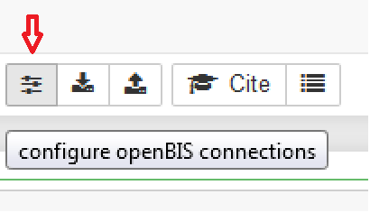

Add your user credentials and password and click on create/connect. 

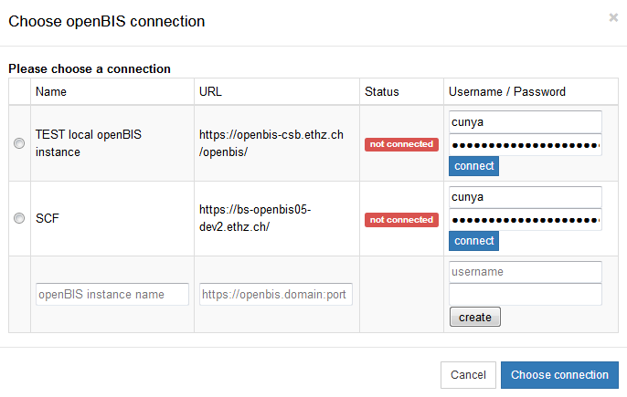

If the connection is successful, the status will turn green.  

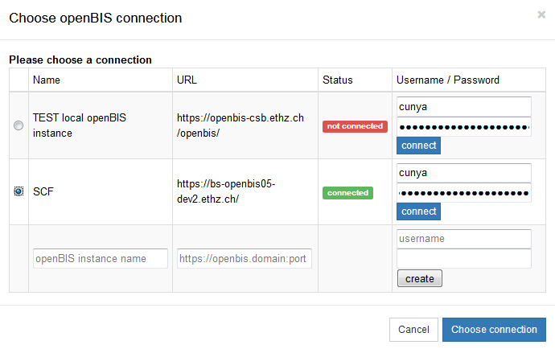

To choose the newly created connection, hit the radio button on the left and click choose connection.

#### Download

Now you are ready to download or upload datasets form openBIS. In the openBIS-ELN copy the permID (i.e. 20190617125718758-357713 )or the experiment identifier (i.e. path listed under Experiment: /CUNYA/YEAST_TRANSFORMATION_OPTIMIZATION/YEAST_TRANSFORMATION_OPTIMIZATION_EXP_3) of the dataset to download (i.e. two Excel files as shown below).

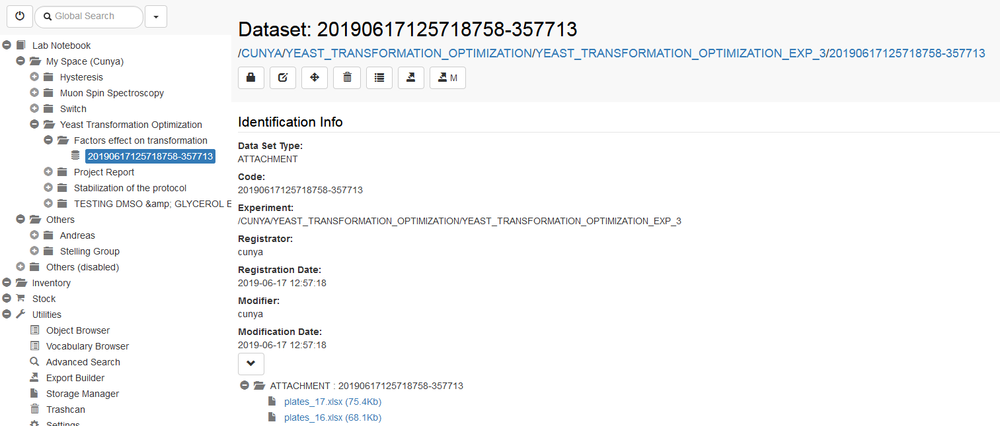


In an open Jupyter notebook, click on the download icon to open the download dialog. 

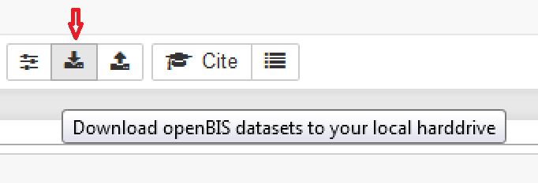

Add either the permID or the identifier of the datasets you like to download as described above. All the datasets of e.g. an experiment are then listed and you can select the ones to download and specify the location where you want to download the data to. 

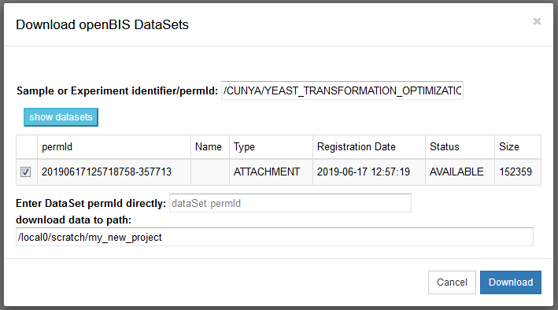

A green notification is shown at the top of the notebook after the successful download.  

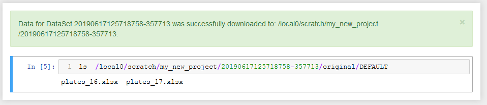

Now the datasets are ready in a sub folder named with the permID of the dataset. Additionally, the dataset download and its provenance gets tracked by the notebook (in its meta-data) such that it is clear from which openBIS instance which dataset was downloaded from.

The data can now be used i.e. imported in the current notebook and analyzed.

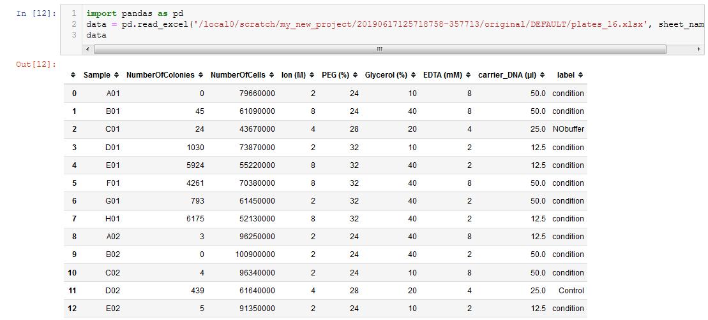

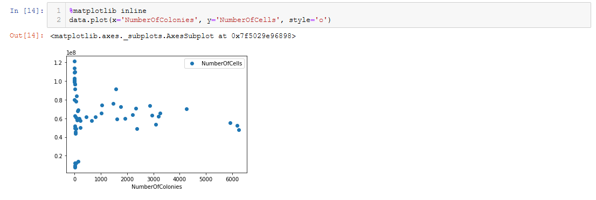

#### Upload

To upload a new or modified dataset, figure, table etc together with the current notebook, hit the upload button. 

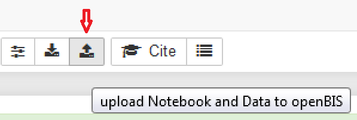

Now you need to select the dataset type of the data to be uploaded, i.e. ANALYZED_DATA and specify the mandatory meta-data. The file browser lets you select which additional file(s) should be included in the upload.

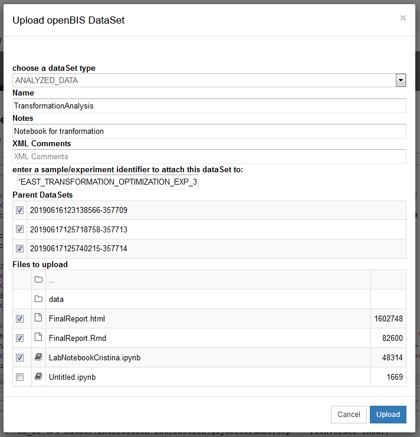

All the downloaded datasets from before, are automatically added as parents to notebook such that the record and the relationship of which 'raw data' was used with this notebook.

### Installation of additional Kernels

A list and installation guidelines for additional kernels to run notebooks in other programming languages can be found here: [Jupyter-kernels](https://github.com/jupyter/jupyter/wiki/Jupyter-kernels)
